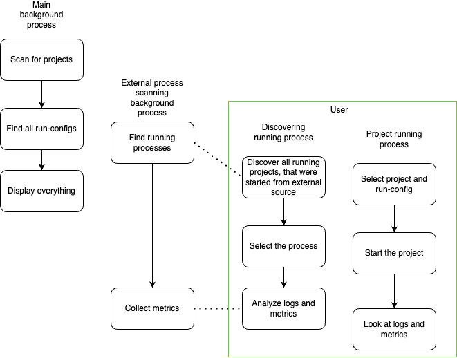
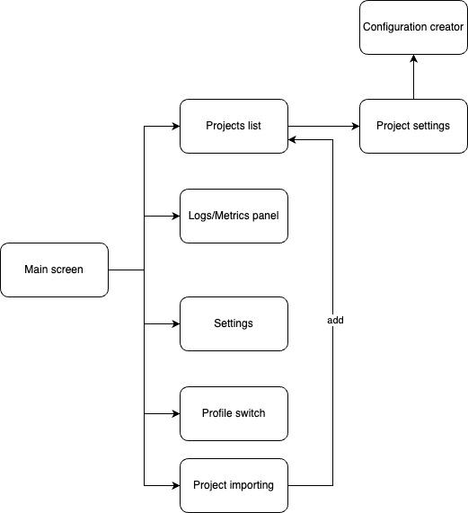
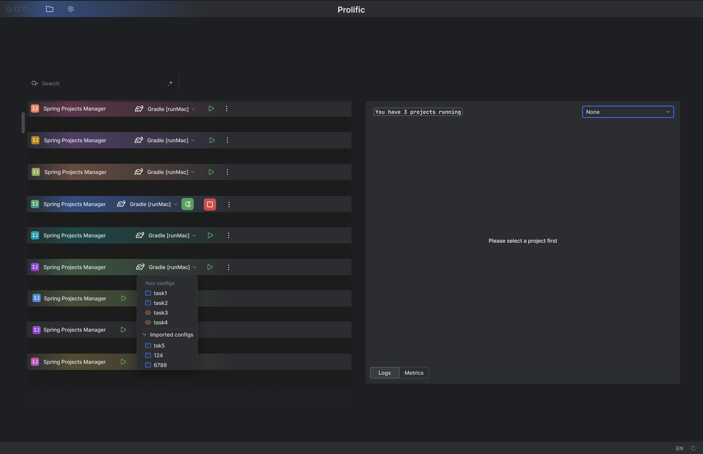

# Vision Prolific

## Vision

Vision Prolific is an application designed for convenient project management for developers. It allows users to quickly locate, launch, and manage their projects from a single access point. The application will be monetized through a commercial licensing model, with separate pricing plans for corporations while remaining free for individual users.

## Usage Scenario

Every developer works with multiple projects, creating new ones or launching existing ones. However, there is currently no convenient way to manage all projects simultaneously. Prolific solves this problem through:

* Automatic project discovery
* Support for dynamically configurable plugins
* An intuitive management interface

## Functionality

* Automatic scanning of the computer for projects.
* Detection of project types with flexible customization through a plugin system.
* Launching, stopping, and restarting projects from a single management point.
* Viewing logs and metrics in real-time.
* Saving and automatically detecting the last used launch configurations.
* Creating and using custom configurations.
* Parallel launching of multiple projects simultaneously.

## Know Your Users

### Users

The primary target audience is developers working on various projects. The application is primarily aimed at JetBrains product users, as integration with their services is planned.

**Potential audience:** All developers.

**Ideal user count:** Maximum possible number of developers.

**Average usage time:** Several hours per day.

**User level:** Developers of any level can use the application thanks to its simple and intuitive interface.

## Users Language

### Concepts & Terminology

Prolific manages developers' projects by providing a unified entry point for launching, monitoring, and configuring them. Key concepts include:

* **Project:** A software product that a developer is working on. It can involve different programming languages and development environments.
* **Run Configuration:** The parameters used to launch a project (e.g., command-line flags, environment variables).
* **Plugins:** Extensions that allow support for new types of projects.
* **Logs & Metrics:** System messages and performance indicators of running projects.
* **Workspace:** An environment where users manage their projects.

The terminology is developer-oriented, aligning with commonly used software development terms. The application's interface and documentation will be structured accordingly to ensure clarity for programmers.

## Most Common Tasks

A developer, for example, John Doe, wants to:

* Quickly access all their projects.
* Start, stop, and restart them.
* Flexibly change launch configurations.
* View logs and metrics.
* Manage multiple projects simultaneously from one interface.

## Main Processes

* Project discovery and indexing.
* Launching and stopping projects.
* Configuration management.
* Log and metric visualization.
* Plugin management.

## Navigation

The application will feature a streamlined interface with the following sections:

* **Projects List:** A detailed view of all detected projects.
* **Configuration Panel:** Options for managing run configurations.
* **Logs & Metrics:** Real-time monitoring of project activity.

## Mockups

## Non-Functional Requirements

* **Performance:** Efficient project scanning without system overload.
* **Scalability:** Ability to handle thousands of projects efficiently.
* **Cross-platform support:** Compatible with major operating systems.

## Revenue Model (Monetization)

Prolific will follow a commercial licensing model:

* **Free version:** Available for individual users with full functionality.
* **Commercial licenses:** Required for businesses and corporations, with different pricing plans depending on the size and needs of the organization.

## Roadmap

### MVP (Minimum Viable Product)

* Project discovery on disk.
* Basic project launch and stop functionality.
* Log integration.
* Support for multiple project types through plugins.

### Beta Version

* Improved configuration system.
* Enhanced UI/UX.

### Full Release

* Integration with JetBrains.
* Commercial licensing system.
* Performance optimization.

## Risks & Challenges

* **Complexity of integration with JetBrains:** Requires interaction with their configurations.
* **Performance:** It is essential to ensure project scanning does not overload the system.

## Conclusion

Prolific is an innovative application for convenient project management for developers. It automates routine processes, improves control over project launches, and provides a flexible management system. Monetization through commercial licensing will allow product development and support. The project is targeted at developers of all levels, primarily at JetBrains users. Thanks to its versatility and rich functionality, Prolific has a strong chance of carving out its niche in the developer tool landscape.