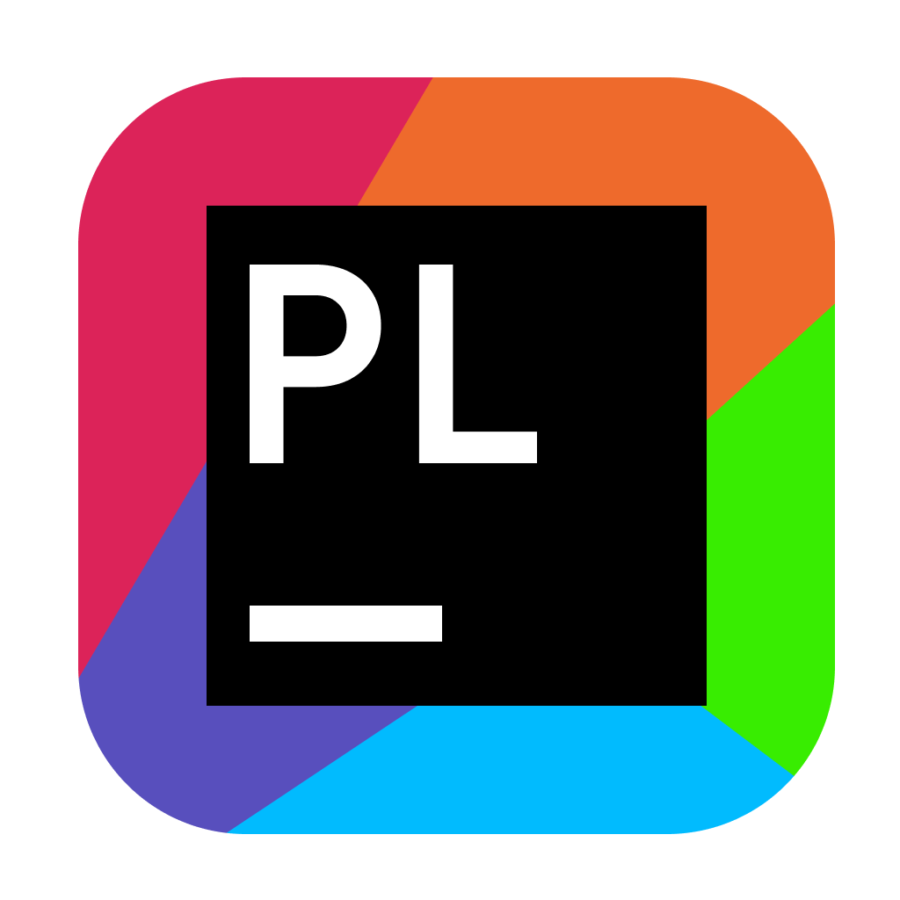

<figure>

</figure>
<h2 id="overview">Overview</h2>

Prolific is a modern, cross-platform project management application
built with JavaFX and Spring Boot. It helps developers organize and
manage their projects by automatically detecting project types,
providing a clean user interface for project navigation, and offering
tools to streamline development workflows.

<h2 id="features">Features</h2>
<ul>
<li><strong>Project Detection</strong>: Automatically identifies
different project types based on file patterns</li>
<li><strong>Project Management</strong>: Add, remove, and organize your
development projects</li>
<li><strong>Star Projects</strong>: Mark your favorite or frequently
used projects for quick access</li>
<li><strong>Modern UI</strong>: Clean, responsive interface with
customizable themes</li>
<li><strong>Cross-Platform</strong>: Works on Windows, macOS, and
Linux</li>
</ul>
<h2 id="technologies">Technologies</h2>
<ul>
<li><strong>Java 23</strong>: Built with the latest Java features</li>
<li><strong>JavaFX 23.0.1</strong>: For the modern, responsive UI</li>
<li><strong>Spring Boot</strong>: For dependency injection and
application framework</li>
</ul>
<h2 id="getting-started">Getting Started</h2>
<h3 id="prerequisites">Prerequisites</h3>
<ul>
<li>Java 23 or higher</li>
<li>Gradle (optional, wrapper included)</li>
</ul>
<h3 id="installation">Installation</h3>
<h4 id="from-source">From Source</h4>
<ol type="1">
<li>
Clone the repository:

<pre><code>git clone https://github.com/nevertouchgrass/prolific.git
cd prolific</code></pre></li>
<li>
Build the application:

<pre><code>./gradlew build</code></pre></li>
<li>
Run the application:

<ul>
<li>On Linux: <code>./gradlew runLinux</code></li>
<li>On Windows: <code>./gradlew runWindows</code></li>
<li>On Mac: <code>./gradlew runMac</code></li>
</ul></li>
</ol>
<h4 id="using-installer">Using Installer</h4>

Not yet implemented :(

<h2 id="usage">Usage</h2>
<h3 id="adding-projects">Adding Projects</h3>
<ol type="1">
<li>Click the settings button in the top-right corner</li>
<li>Select “Add Project”</li>
<li>Browse to your project directory</li>
<li>Prolific will automatically detect the project type and add it to
your list</li>
</ol>
<h3 id="managing-projects">Managing Projects</h3>
<ul>
<li><strong>Star a Project</strong>: Click the star icon on a project to
mark it as a favorite</li>
<li><strong>Remove a Project</strong>: Right-click on a project and
select “Remove”</li>
<li><strong>Project Settings</strong>: Right-click on a project to
access additional settings</li>
</ul>
<h2 id="building-from-source">Building from Source</h2>
<h3 id="creating-a-native-installer">Creating a Native Installer</h3>
<pre><code>./gradlew jpackageLinux</code></pre>
<pre><code>./gradlew jpackageMac</code></pre>
<pre><code>./gradlew jpackageWindows</code></pre>

This will create a native installer for your host platform in the
<code>build/image</code> directory. (You may need to install <a href="www.firegiant.com/wixtoolset/">Wix Toolset</a> to run <code>jpackageWindows</code> task).

<h1 id="run-configurations">
Run configurations
</h1>

This window allows you to declare how the app should run your project.
You can choose from several options:

<ul>
<li>

<strong>Command</strong>: This is the most common option. You can
specify any command that you want to run. You can use this option to run
any script or program that you want.

</li>
<li>

<strong>Gradle</strong> 

This option allows you to run a Gradle task. You can specify the task
name and any additional arguments that you want to pass to the task. You
can use this option to run any Gradle task that your project’s
build.gradle file supports.

</li>
<li>

<strong>Python</strong> 

This option allows you to run a Python script. You can specify the
script name and any additional arguments that you want to pass to the
script. You can use both absolute and relative paths.

</li>
<li>

<strong>Anaconda</strong> 

Config name, arguments and path to script are the same as in Python run
config. The only difference is that you can specify conda environment
name. This will activate the conda environment before running the
script. To use this option you need to configure <strong><em>Anaconda
path in settings!</em></strong>

</li>
<li>

<strong>Maven</strong> 

This option allows you to run a Maven task. You can specify the task
name and any additional arguments that you want to pass to the task.

</li>
</ul>
<h1 id="profiles">
Profiles
</h1>

Prolific supports multiple profiles. They are used to manipulate with
permissions

<figure>

</figure>

<figure>

</figure>

Power user can: - Exclude projects from scanning (will also delete a
project from the list) - Delete project from PC

<h2 id="default-user">
Default user
</h2>
<figure>

</figure>

Default user can’t exclude dirs or delete projects.

This system was designed to prevent users from deleting projects or
excluding dirs from scanning unintentionally.

<h1 id="settings">
Settings
</h1>

The Settings screen is where you can configure a variety of options for
the app. The settings are divided into several categories:

<h2 id="general">
General
</h2>
<ul>
<li>

<strong>Root path to scan</strong>: This is one of the most important
settings. It defines the root path where the app will scan for files.
The app will look for files in this directory and its subdirectories.
You can set this to any directory on your system. You can use a
<svg width="16" height="16" viewBox="0 0 20 20" fill="none" xmlns="http://www.w3.org/2000/svg" style="vertical-align: middle;"><path d="M3.25 3.25H7.6377C7.6817 3.25 7.72498 3.2615 7.7627 3.2832L7.79785 3.30762L10.5195 5.57617L10.7285 5.75H17C17.6904 5.75 18.25 6.30964 18.25 7V15.167C18.2498 16.0672 17.5529 16.75 16.75 16.75H3.25C2.44714 16.75 1.75017 16.0672 1.75 15.167V4.83301C1.75017 3.93278 2.44715 3.25 3.25 3.25Z" stroke="#CED0D6" stroke-width="1.5"/></svg>
button to select the directory.

</li>
<li>

<strong>Excluded dirs</strong>: This setting allows you to specify
directories that should be excluded from the scan. You can add multiple
directories, and they will be ignored during the scan process. You
should use a semicolon (;) to separate multiple directories. For
example: <code>dir1;dir2;dir3</code>. The app will not scan these
directories or any of their subdirectories. This field also supports a
glob pattern, so you can use wildcards to exclude multiple directories
that match a certain pattern. For example:
<code>dir<em>;dir2</em></code> will exclude all directories that start
with <code>dir</code> or <code>dir2</code>.

</li>
<li>

<strong>Max scan depth</strong>: This setting allows you to specify the
maximum depth of subdirectories to scan. For example, if you set this to
2, the app will scan the root directory and its immediate
subdirectories, but not any subdirectories of those subdirectories. This
can be useful if you have a large directory structure and want to limit
the scan to a certain level.

</li>
<li>

<strong>Rescan every hours</strong>: App automatically rescan the root
path every X hours. This is useful if you want to keep the app up to
date with the latest changes in your files. You can set this to any
number of hours. Keep in mind that rescanning will be performed only if
the app restarts. If you want to rescan the root path immediately, you
can use the “Run scanning” button in the app.

</li>
<li>

<strong>Language</strong>: We currently support English, Slovak and
Russian. You can select the language from the dropdown menu. No restart
is required

</li>
</ul>
<h2 id="environment">
Environment
</h2>
<figure>

</figure>

This section allows you to configure the environment settings for the
app. But for common use, you don’t need to change anything here.

<ul>
<li>
<strong>Python path</strong>: <em>Default value is python from
PATH.</em> If you want to use some python binary (different from one
that is in PATH) you can configure this here. This is useful if you have
multiple versions of Python installed on your system or if you want to
use a specific version of Python for the app. You can set this to any
valid path to a Python binary. You can use a
<svg width="16" height="16" viewBox="0 0 20 20" fill="none" xmlns="http://www.w3.org/2000/svg" style="vertical-align: middle;"><path d="M3.25 3.25H7.6377C7.6817 3.25 7.72498 3.2615 7.7627 3.2832L7.79785 3.30762L10.5195 5.57617L10.7285 5.75H17C17.6904 5.75 18.25 6.30964 18.25 7V15.167C18.2498 16.0672 17.5529 16.75 16.75 16.75H3.25C2.44714 16.75 1.75017 16.0672 1.75 15.167V4.83301C1.75017 3.93278 2.44715 3.25 3.25 3.25Z" stroke="#CED0D6" stroke-width="1.5"/></svg>
</li>
<li>
<strong>Gradle</strong>: By default run configs will try to use
project’s Gradle wrapper (gradlew). If you want to use some other Gradle
binary, you can configure this here.
</li>
<li>
<strong>Maven path</strong>: By default run configs will try to use
project’s Maven (mvn). If you want to use some other Maven binary, you
can configure this here.
</li>
<li>
<strong>JDK path</strong>: By default run configs won’t explicitly set
JDK path. If you think, that you need to use some concrete JDK version,
you can set it here. (For gradle tasks will be specified
<code>-Dorg.gradle.java.home=&lt;path&gt;</code> and for maven tasks)
<code>-Djava.home=&lt;path&gt;</code>)
</li>
<li>
<strong>Anaconda path</strong>: <em>You must provide this path in order
to work with anaconda run configs</em> This path is the path to
directory where all your conda environments are stored. Usually it is
something like <code>/Users/user/miniconda3/</code> (you mustn’t specify
<code>/envs/</code> part)
</li>
</ul>
