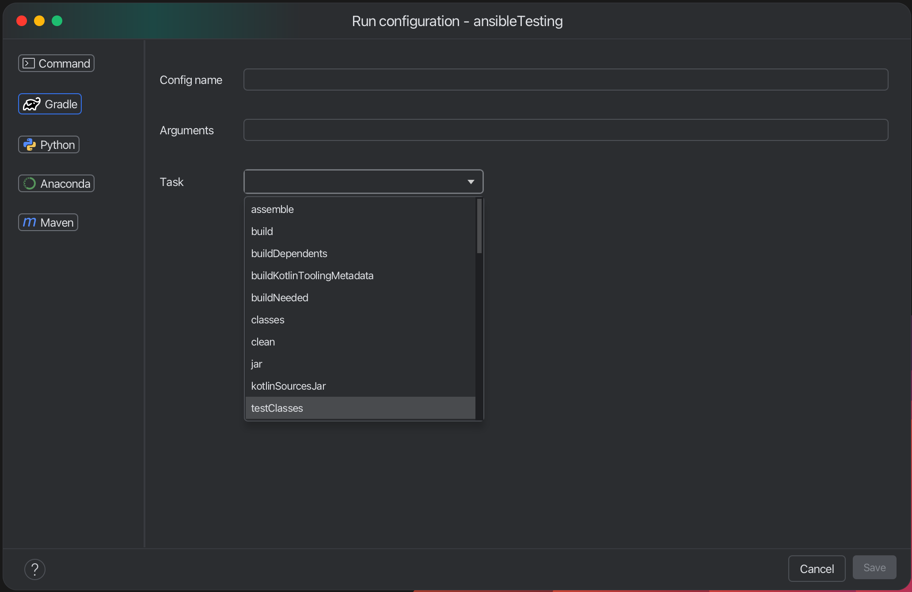
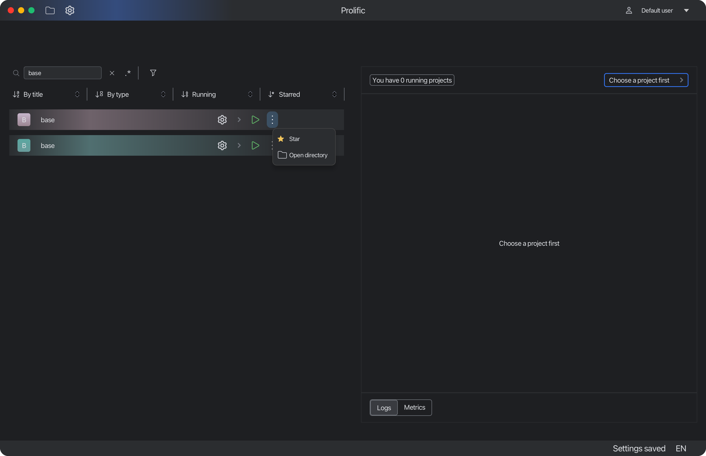

# Prolific

Prolific is a project management tool designed to help developers manage their projects efficiently. It provides a
user-friendly interface and powerful features to streamline your workflow.

## Features

### Project scanning


Prolific automatically scans your projects and detects their types. It uses a set of predefined rules to identify
different project types based on the files and directories present in your project. This allows you to quickly add and
manage your projects without having to manually configure them.

### Add a project manually


You can add a project manually if it was not added automatically.

### Filtering and searching


Prolific provides powerful filtering and searching capabilities to help you find the projects you need quickly. You can
filter projects by their title, type, if they are running or whether they are starred. You can also search using Regex.
You can apply filters e.g. to show only starred projects or manually added projects.


### Configuration importing


Prolific can import existing run configuration from JetBrains IDEs. Currently supports Gradle tasks, Maven goals, Python and Flusk


### Configuration creation

You can create your own run configurations.


This window allows you to declare how the app should run your project. You can choose from several options:

- **Command**: This is the most common option. You can specify any command that you want to run. You can use this option
  to run any script or program that you want.
- **Gradle**
  

  This option allows you to run a Gradle task. You can specify the task name and any additional arguments that you want
  to pass to the task. You can use this option to run any Gradle task that your project's build.gradle file supports.
- **Python**
  

  This option allows you to run a Python script.
  You can specify the script name and any additional arguments that you want to pass to the script.
  You can use both absolute and relative paths.
- **Anaconda**
  

  Config name, arguments and path to script are the same as in Python run config. The only difference is that you can
  specify conda environment name. This will activate the conda environment before running the script. To use this option
  you need to configure **_Anaconda path in settings!_**
- **Maven**
  

  This option allows you to run a Maven task. You can specify the task name and any additional arguments that you want
  to pass to the task.


### Run and monitor


You can run your project by clicking the play button. This will start the project and show the output in the console.

You can also stop the project by clicking the stop button.


You can monitor CPU and memory usage of your project. This will show you the current CPU and memory usage of your project in real time.

### Terminated processes information


You can also see logs and metrics of terminated processes. Currently, you will see only 3 last terminated processes for each project.

### Notifications


Receive the most important notifications in real-time.

### Manage your projects


You can star your projects to mark them as favorites. This will make it easier to find them later. You can also remove a project, delete it or open it in the file explorer.

### Settings


The Settings screen is where you can configure a variety of options for the app. The settings are divided into several
categories:

#### General

- **Root path to scan**: This is one of the most important settings. It defines the root path where the app will scan
  for files. The app will look for files in this directory and its subdirectories. You can set this to any directory on
  your system. You can use
  a <svg width="16" height="16" viewBox="0 0 20 20" fill="none" xmlns="http://www.w3.org/2000/svg" style="vertical-align: middle;"><path d="M3.25 3.25H7.6377C7.6817 3.25 7.72498 3.2615 7.7627 3.2832L7.79785 3.30762L10.5195 5.57617L10.7285 5.75H17C17.6904 5.75 18.25 6.30964 18.25 7V15.167C18.2498 16.0672 17.5529 16.75 16.75 16.75H3.25C2.44714 16.75 1.75017 16.0672 1.75 15.167V4.83301C1.75017 3.93278 2.44715 3.25 3.25 3.25Z" stroke="#CED0D6" stroke-width="1.5"/></svg>
  button to select the directory.

- **Excluded dirs**: This setting allows you to specify directories that should be excluded from the scan. You can add
  multiple directories, and they will be ignored during the scan process. You should use a semicolon (;) to separate
  multiple directories. For example: `dir1;dir2;dir3`. The app will not scan these directories or any of their
  subdirectories. This field also supports a glob pattern, so you can use wildcards to exclude multiple directories that
  match a certain pattern. For example: `dir*;dir2*` will exclude all directories that start with `dir` or `dir2`.

- **Max scan depth**: This setting allows you to specify the maximum depth of subdirectories to scan. For example, if
  you set this to 2, the app will scan the root directory and its immediate subdirectories, but not any subdirectories
  of those subdirectories. This can be useful if you have a large directory structure and want to limit the scan to a
  certain level.

- **Rescan every hours**: App automatically rescan the root path every X hours. This is useful if you want to keep the
  app up to date with the latest changes in your files. You can set this to any number of hours. Keep in mind that
  rescanning will be performed only if the app restarts. If you want to rescan the root path immediately, you can use
  the "Run scanning" button in the app.
- **Language**: We currently support English, Slovak and Russian. You can select the language from the dropdown menu. No
  restart is required

#### Environment


This section allows you to configure the environment settings for the app.
But for common use, you don't need to change anything here.

- **Python path**: *Default value is python from PATH.* If you want to use some python binary (different from one that
  is in PATH) you can configure this
  here. This is useful if you have multiple versions of Python installed on your system or if you want to use a specific
  version of Python for the app. You can set this to any valid path to a Python binary. You can use
  a <svg width="16" height="16" viewBox="0 0 20 20" fill="none" xmlns="http://www.w3.org/2000/svg" style="vertical-align: middle;"><path d="M3.25 3.25H7.6377C7.6817 3.25 7.72498 3.2615 7.7627 3.2832L7.79785 3.30762L10.5195 5.57617L10.7285 5.75H17C17.6904 5.75 18.25 6.30964 18.25 7V15.167C18.2498 16.0672 17.5529 16.75 16.75 16.75H3.25C2.44714 16.75 1.75017 16.0672 1.75 15.167V4.83301C1.75017 3.93278 2.44715 3.25 3.25 3.25Z" stroke="#CED0D6" stroke-width="1.5"/></svg>
- **Gradle**: By default run configs will try to use project's Gradle wrapper (gradlew). If you want to use some other
  Gradle binary, you can configure this here.
- **Maven path**: By default run configs will try to use project's Maven (mvn). If you want to use some other
  Maven binary, you can configure this here.
- **JDK path**: By default run configs won't explicitly set JDK path. If you think, that you need to use some concrete
  JDK
  version, you can set it here. (For gradle tasks will be specified `-Dorg.gradle.java.home=<path>` and for maven tasks)
  `-Djava.home=<path>`)
- **Anaconda path**: *You must provide this path in order to work with anaconda run configs* This path is the path to
  directory where all your conda environments are stored. Usually it is something like `/Users/user/miniconda3/` (you
  mustn't specify `/envs/` part)

### Profiles

Prolific supports multiple profiles. They are used to manipulate with permissions


---


Power user can:

- Exclude projects from scanning (will also delete a project from the list)
- Delete project from PC

#### Default user



Default user can't exclude dirs or delete projects.

This system was designed to prevent users from deleting projects or excluding dirs from scanning unintentionally.

#### No Metrics

This profile is used when you don't need metrics. This will all metrics collection and increase performance of the app.

### Plugins


Prolific supports plugins. You can teach prolific how to determine a project type.
You will need to add new .xml file.
This file should have the next structure:
```xml
<projects>
  <project>
    <name>Your project type</name>
    <identifiers>
      <file>Some file name that will determine your project</file>
      <folder>Some folder name/pattern that will determine your project</folder>
    </identifiers>
  </project>
</projects>
```

You can use any combination of file and folder names. You can also use wildcards in the folder name. For example: `dir*` will match any
directory that starts with `dir`. You can also use `*` to match any directory. For example: `*` will match any directory.


## Architecture


## Project related files
For unix systems Prolific creates `.prolific` directory in your user's home directory. This directory contains all
project related files as database, settings, plugins, run configs, and so on.

For windows systems Prolific creates `Prolific` directory in AppData folder.

## Run

You can install a configured installer for your platform from `Releases` or you can run using `jar` file.
If you want to run the app using a jar file, use this command
```bash
java -jar <path_to_jar_file>
```
