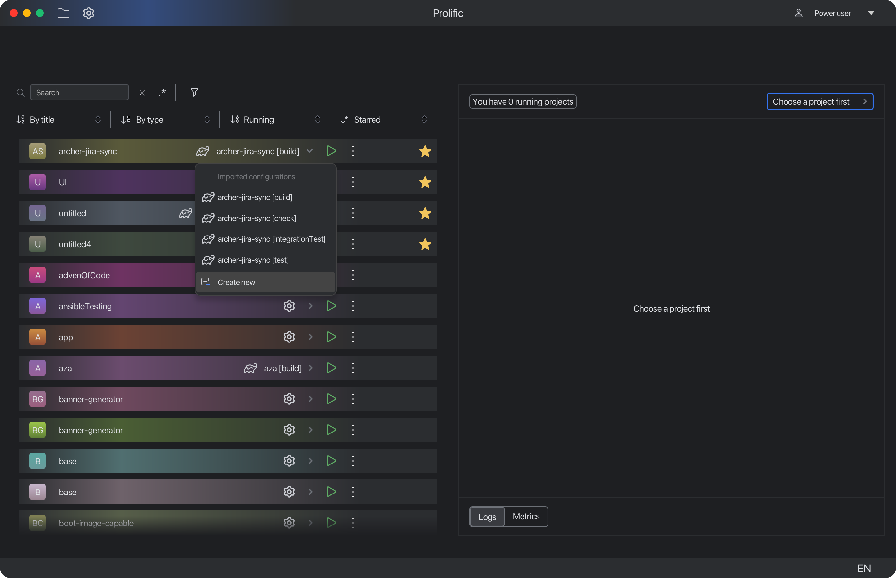
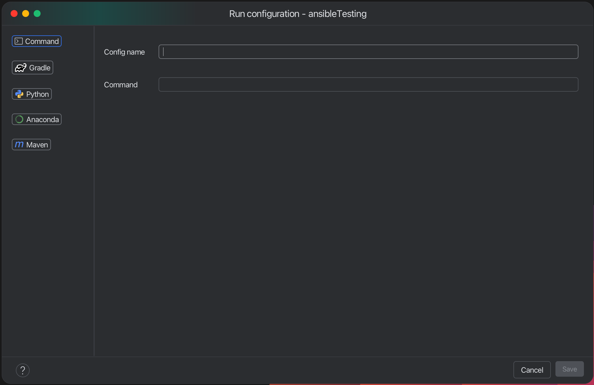
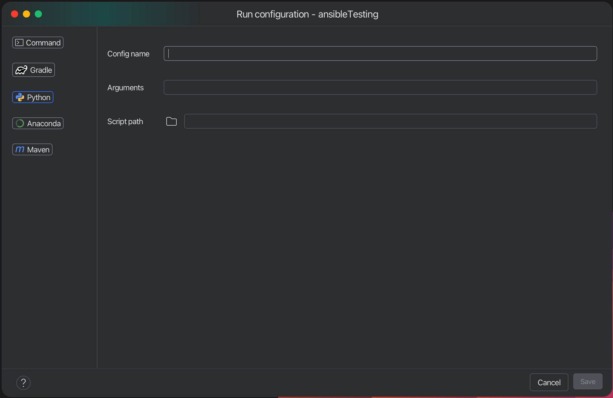

# Run configurations

This window allows you to declare how the app should run your project. You can choose from several options:

- **Command**: This is the most common option. You can specify any command that you want to run. You can use this option
  to run any script or program that you want.
- **Gradle**
  

  This option allows you to run a Gradle task. You can specify the task name and any additional arguments that you want
  to pass to the task. You can use this option to run any Gradle task that your project's build.gradle file supports.
- **Python**
  

  This option allows you to run a Python script.
  You can specify the script name and any additional arguments that you want to pass to the script.
  You can use both absolute and relative paths.
- **Anaconda**
  

  Config name, arguments and path to script are the same as in Python run config. The only difference is that you can
  specify conda environment name. This will activate the conda environment before running the script. To use this option
  you need to configure **_Anaconda path in settings!_**
- **Maven**
  

  This option allows you to run a Maven task. You can specify the task name and any additional arguments that you want
  to pass to the task.