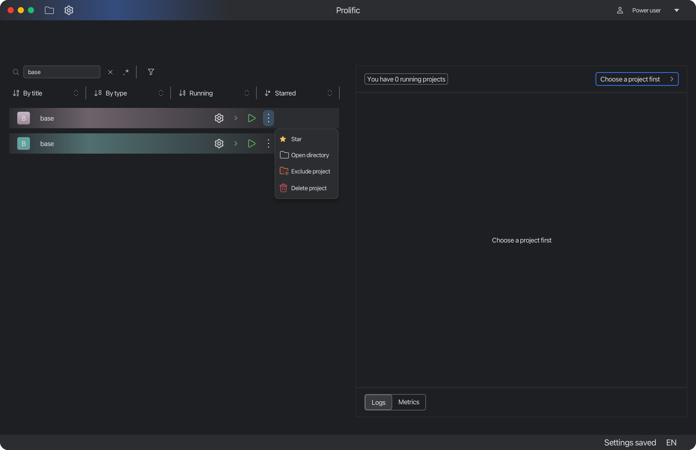

# Profiles

Prolific supports multiple profiles. They are used to manipulate with permissions

---

Power user can:
- Exclude projects from scanning (will also delete a project from the list)
- Delete project from PC

## Default user

Default user can't exclude dirs or delete projects.

This system was designed to prevent users from deleting projects or excluding dirs from scanning unintentionally.